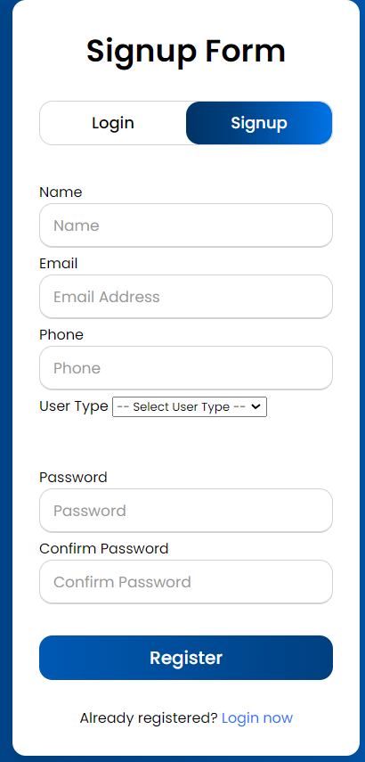
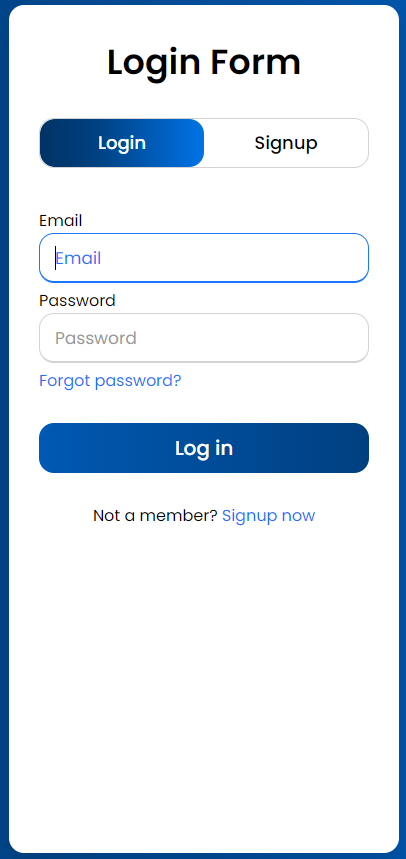
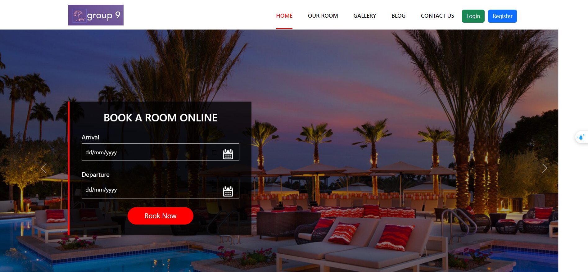
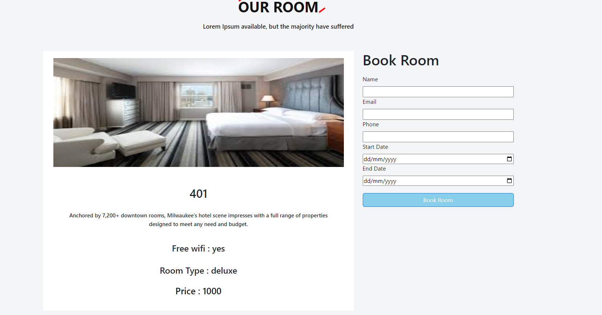
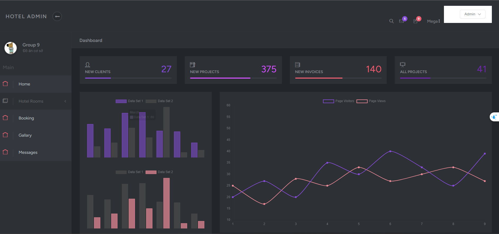
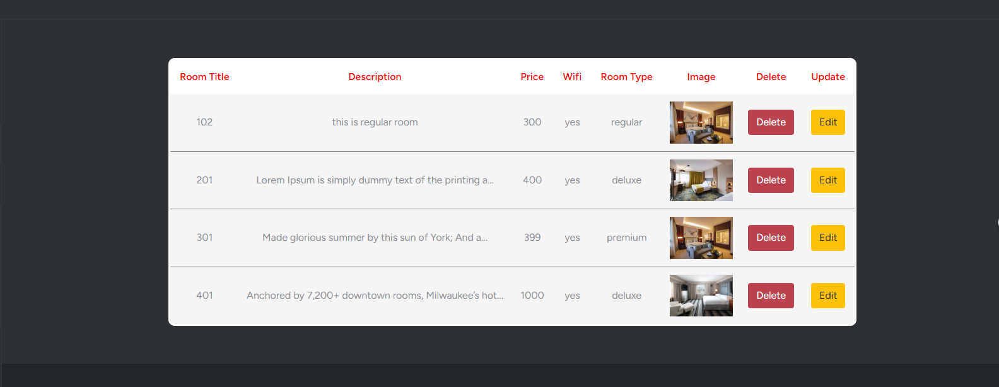
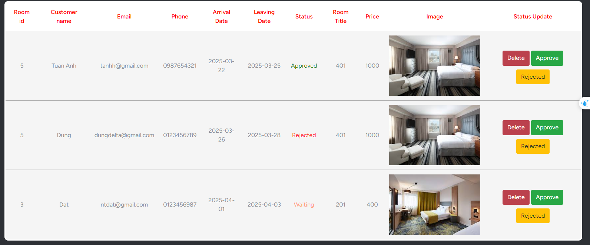

# Hotel Booking System

## Thành viên
- Vũ Tuấn Anh
- Trần Mai Anh
- Nguyễn Tiến Đạt

## 📝 Mô tả ngắn gọn
Hệ thống đặt phòng khách sạn trực tuyến giúp người dùng dễ dàng tìm kiếm, đặt phòng và quản lý đặt phòng của mình một cách thuận tiện. Dành cho cả khách hàng và quản trị viên khách sạn.

## ✨ Các tính năng chính
- Đăng ký & Đăng nhập người dùng
- Tìm kiếm và đặt phòng khách sạn
- Quản lý đặt phòng của người dùng
- Quản lý phòng, dịch vụ và đặt phòng dành cho quản trị viên
- Thanh toán trực tuyến (tùy chọn)
- Hệ thống đánh giá và phản hồi

## 🛠 Công nghệ sử dụng
- **Framework:** Laravel 10
- **Ngôn ngữ:** PHP
- **Cơ sở dữ liệu:** MySQL
- **Local Server:** XAMPP
- **Frontend:** Blade Template, Bootstrap


## 🚀 Cài đặt và chạy dự án
### 1️⃣ Clone repository
```sh
git clone https://github.com/user/hotel-booking.git
cd hotel-booking
```

### 2️⃣ Cài đặt dependencies
```sh
composer install
npm install
npm run build
```

### 3️⃣ Cấu hình môi trường
```sh
cp .env.example .env
php artisan key:generate
```
Cập nhật file `.env` với thông tin kết nối database. Ngoài ra, có thể nhập dữ liệu mẫu từ file `hotel2.sql` vào database để thuận lợi cho việc deploy sản phẩm

### 4️⃣ Chạy migrations
```sh
php artisan migrate --seed
```

### 5️⃣ Khởi động server
```sh
php artisan serve
```
Sau đó truy cập `http://127.0.0.1:8000/`

## 📸 Ảnh giao diện
Dưới đây là một số hình ảnh về giao diện của hệ thống:


### Đăng ký/ Đăng nhập
|  |  |
|----------------------|----------------------|


### 🌍 Trang chủ


### 🏨 Trang đặt phòng


### Trang feedback


### 🔧 Trang quản trị


### 🔧 Trang quản trị đặt phòng


### 🔧 Trang quản trị đặt phòng



## 🔚 Tổng kết
Hệ thống đặt phòng khách sạn này giúp đơn giản hóa quy trình đặt phòng, mang đến trải nghiệm tiện lợi cho người dùng và dễ dàng quản lý cho chủ khách sạn. Với Laravel, PHP và MySQL, dự án đảm bảo tính linh hoạt, bảo mật và hiệu suất tốt. Hy vọng dự án sẽ hữu ích và có thể mở rộng thêm nhiều tính năng trong tương lai!
